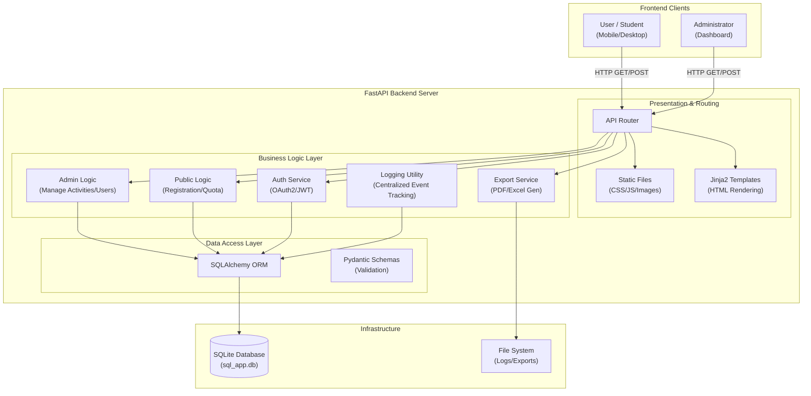

# DSNPRU_REG - School Activity Registration System

**Version 3.0**

A comprehensive web-based activity registration system designed for schools. It allows students to view and register for activities, while providing administrators with powerful tools to manage activities, students, and registration data. Built with **FastAPI** for high performance and **Alpine.js** for a responsive, modern frontend.

---

## Table of Contents

- [Overview](#overview)
- [Features](#features)
- [Architecture](#architecture)
- [Installation](#installation)
- [Configuration](#configuration)
- [Usage Guide](#usage-guide)
- [API Reference](#api-reference)
- [Database Schema](#database-schema)
- [Troubleshooting](#troubleshooting)

---

## Overview

DSNPRU_REG solves the challenge of manual activity registration in schools:

- **Eliminates Paperwork**: Students register online, saving paper and reducing errors.
- **Real-time Quota Management**: Prevents overbooking of activities automatically.
- **Centralized Data**: All registration data is stored securely and is easily exportable.
- **Comprehensive Logging**: Tracks every administrative action and student registration for full accountability.
- **Role-Based Access**: Distinguishes between General Staff and Super Administrators for secure management.
- **Team Activity Support**: Full support for team/partner-based activities with configurable team sizes.

---

## Features

### Public / Student Interface

The student-facing side is designed for ease of use and quick access information:

- **Activity Browser**: View all available activities with descriptions, remaining seats, and schedules.
- **Real-time Status**: Clearly see which activities are Open or Closed.
- **Activity Type Badges**: Visual indicators showing whether an activity is Individual (เดี่ยว) or Team/Partner (ทีม/คู่).
- **Responsive Design**: Works perfectly on mobile phones, tablets, and desktop computers.
- **Clickable Branding**: The navigation bar logo and title link directly back to the main registration page.
- **Real-time Seat Counts**: Activity seat counts update automatically every 10 seconds without page refresh.
- **Student Context Display**: After entering student ID, view registered activities and remaining group quotas.
- **Partner Search Autocomplete**: Search for partners by name or student number with autocomplete dropdown.

### Team Registration System (V3 NEW)

A complete system for registering team-based or partner-based activities:

- **Activity Types**: Activities can be configured as "Individual" (เดี่ยว) or "Team" (ทีม/คู่).
- **Configurable Team Size**: Admins can set maximum team members per activity (e.g., 2 for pairs, 5 for teams).
- **Dynamic Partner Input**: Registration modal dynamically shows input boxes based on max team size.
  - If max = 5, students see 4 partner input boxes (for members 2-5, since they are member 1).
- **Partner Search**: Each partner slot has autocomplete search by name or student number.
  - Excludes self and already-selected partners from results.
  - Shows confirmation when a partner is selected (green highlight).
  - Clear button (X) to remove a selected partner.
- **Team Name**: Students can optionally name their team/group.
- **Apply Alone Option**: Students can choose to register for a team activity as a solo participant.
- **Validation**: Backend validates:
  - Team size does not exceed maximum allowed.
  - No duplicate partners.
  - All partners exist in the system.
  - Partners are not already registered for the activity.
- **Member Summary**: Real-time display of how many team members are selected.

### Student Registration Cancellation (V3 NEW)

Students can now manage their own registrations:

- **Cancel Button**: Each registered activity shows a trash icon button.
- **Confirmation Dialog**: SweetAlert2 confirmation before cancellation.
- **Ownership Validation**: Backend verifies the student owns the registration before allowing cancellation.
- **Real-time Update**: After cancellation, the UI updates to reflect new quotas and available seats.

### Admin Dashboard & Management

A comprehensive backend for school staff, accessed via a **hidden login portal**:

**Security & Access**
- **Hidden Admin Link**: The admin login is discreetly located by clicking the **©** copyright symbol in the footer of the main page.
- **Secure Authentication**: JWT-based login sessions with automatic timeout.
- **Role-Based Access Control (RBAC)**:
    - **Superuser**: Can manage other admins and view system logs.
    - **Staff**: Can manage activities and students but cannot alter system settings.

**Activity Management**
- **CRUD Operations**: Create, Read, Update, and Delete activities.
- **Activity Types**: Choose between Individual and Team activities when creating.
- **Max Team Size**: For team activities, set the maximum number of members allowed per team (1-10).
- **Grouping**: Organize activities into groups (e.g., "Sports", "Academic Clubs") with group-level quotas.
- **Classroom Restrictions**: Limit activities to specific classrooms (e.g., "M.1/1 only").
- **Time Scheduling**: Set automatic open and close times for registration.
- **Manual Toggles**: Instantly Open/Close registration for specific activities with a single click.
- **Color Coding**: Assign custom colors to activity cards for visual organization.

**Student Management**
- **Bulk Imports**: Import student lists via Excel files.
- **Search & Filter**: Quickly find students by name or ID.
- **Bulk Actions**: Delete multiple students or update their classroom info in one go.
- **Registration History**: View detailed activity history for each student.
- **Manual Removal**: Admins can now manually remove students from an activity via the Activity Details page.

**Comprehensive Logging System**
- **Action Tracking**: The system logs **ALL** critical actions, including:
    - **Admin Actions**: Login, Logout, Change Password, Create/Delete Admin.
    - **Activity Management**: Create, Update, Delete, and Toggle Status of activities.
    - **Student Management**: Import, Update, Delete, and Bulk operations.
    - **Student Actions**: Student registrations and cancellations are logged with timestamps.
- **Log Viewer**: Superusers can view the full event history in the "Logs" tab of the dashboard.

**Analytics & Insights**
- **Advanced Dashboard**: Visual charts showing registration trends, group popularity, and classroom participation.
- **Real-time Updates**: Data on the dashboard and analytics page refreshes every 30 seconds.
- **Interactive Visualizations**: Powered by Chart.js for beautiful, responsive data insights.

**Data Export**
- **PDF Export**: Professional registration lists with team name grouping for team activities.
- **Excel Export**: Includes team name column for comprehensive data.
- **Team-Aware Formatting**: PDF exports for team activities sort registrations by team name for easier reading.

---

## Architecture

### System Design

The system follows a monolithic architecture with clear separation of concerns between the presentation, logic, and data layers.



### Data Flow Breakdown

1.  **Request Handling**:
    - **FastAPI (Uvicorn)** receives HTTP requests.
    - **Middleware** handles CORS and Logging.
    - **Router** directs traffic to `public` (students), `admin` (management), or `export` endpoints.

2.  **Processing**:
    - **Dependencies** inject database sessions and current user details (via JWT).
    - **Business Logic** verifies quotas, checks classroom restrictions, validates team sizes, and validates input via **Pydantic**.
    - **Logging Utility** (`utils.py`) intercepts critical actions and writes them to the `admin_logs` table.

3.  **Persistence**:
    - **SQLAlchemy** translates Python objects to SQL queries.
    - **SQLite** stores persistent data in `sql_app.db`, ensuring ACID compliance for transactions (like registration claiming).

4.  **Presentation**:
    - **Jinja2** renders HTML templates on the server side, injecting dynamic data (e.g., list of activities).
    - **Alpine.js** on the client side handles interactivity (validations, modals, async fetch requests) without full page reloads.

### Technology Stack

**Backend**
- **FastAPI**: Modern, fast (high-performance) web framework for building APIs with Python.
- **SQLAlchemy**: The Python SQL Toolkit and Object Relational Mapper.
- **Pydantic**: Data validation using Python type hints.
- **Uvicorn**: ASGI web server implementation.

**Frontend**
- **HTML5 & Jinja2 Templates**: Server-side rendering for SEO and speed.
- **Tailwind CSS**: Utility-first CSS framework for rapid UI development.
- **Alpine.js**: Lightweight JavaScript framework for adding interactivity.
- **SweetAlert2 & Toastify**: For beautiful, responsive alerts and notifications.
- **Chart.js**: For data visualization on the dashboard.
- **Lucide Icons**: Modern icon set for UI elements.

**Data & Export**
- **SQLite**: Lightweight, serverless database engine.
- **Pandas / OpenPyXL**: For efficient Excel data processing and export.
- **ReportLab (FPDF2)**: For generating PDF reports with Thai font support.

---

## Installation

### Prerequisites

- Python 3.9 or higher
- pip (Python package manager)

### Step 1: Clone the Repository

```bash
git clone https://github.com/Nonx2360/DSNPRU_REG.git
cd DSNPRU_REG
```

### Step 2: Virtual Environment

It is recommended to use a virtual environment to manage dependencies.

```bash
# Windows
python -m venv venv
.\venv\Scripts\activate

# macOS / Linux
python3 -m venv venv
source venv/bin/activate
```

### Step 3: Install Dependencies

```bash
pip install -r requirements.txt
```

### Step 4: Run Database Migrations

If upgrading from a previous version, run the migration script to add new columns:

```bash
python migrate_db.py
```

This will add:
- `type` column to `activities` table (individual/team)
- `max_team_size` column to `activities` table
- `team_name` column to `registrations` table

### Step 5: Run the Server

```bash
uvicorn backend.main:app --reload
```

The application will be available at:
- **Public**: `http://localhost:8000/`
- **Admin**: Click the **©** symbol in the footer or visit `http://localhost:8000/admin/login`
- **API Docs**: `http://localhost:8000/docs`

---

## Configuration

The system is designed for zero-configuration startup.

**Default Admin Credentials:**
On the first run, if no admin exists, the system automatically creates:
- **Username**: `admin`
- **Password**: `admin123`

*Please change this password immediately after your first login.*

**Database:**
The system uses `sql_app.db` (SQLite) created automatically in the root directory.

---

## Usage Guide

### For Administrators

1.  **Login**: Click the hidden **©** symbol in the footer of the main page.
2.  **Dashboard**: Overview of current status. Use the sidebar or toolbar to navigate.
3.  **Manage Students**:
    - Go to "Student Management".
    - Click "Import (Excel)" to upload your student list.
    - Format: `Number`, `Name`, `Classroom` columns.
4.  **Create Activities**:
    - Go to "Manage Activities".
    - Click "New Activity" or use "Group Manager" to create quotas for sets of activities.
    - **NEW**: Select "Activity Type" - Individual or Team.
    - **NEW**: For Team activities, set "Max Team Size" (e.g., 2 for pairs, 5 for group activities).
    - Set start/end times for automatic control.
5.  **Remove Students**:
    - Navigate to the activity detail page.
    - Click the trash icon next to a student's name to remove their registration. **(Action Logged)**
6.  **Export Data**:
    - Go to "Export".
    - Select "All Activities" or a specific one.
    - Choose PDF or Excel format.
    - **NEW**: For team activities, PDF groups registrations by team name.

### For Students

1.  Visit the home page.
2.  Enter your student number or name to search and identify yourself.
3.  View your registered activities and remaining group quotas.
4.  Browse available activities - look for badges indicating "Individual" (เดี่ยว) or "Team" (ทีม/คู่).
5.  Click to register:
    - **Individual Activity**: Direct registration with confirmation.
    - **Team Activity**: 
      - A modal appears showing max team size.
      - Enter a team name (optional).
      - Search and select partners using the autocomplete inputs.
      - Or check "Apply Alone" to register solo.
      - Submit to register all team members at once.
6.  **Cancel a Registration** (NEW):
    - In your "Registered Activities" section, click the trash icon.
    - Confirm the cancellation.
    - The activity will be removed from your list and seats will be freed.

---

## API Reference

The API is fully documented with Swagger UI at `/docs`. Key endpoints include:

### Auth
- `POST /token`: Login and retrieve JWT token.
- `POST /admin/logout`: Logout and log the event.

### Admin
- `GET /admin/api/dashboard`: Get dashboard statistics.
- `GET /admin/api/students`: List all students.
- `POST /admin/api/students`: Create a new student.
- `PUT /admin/api/students/{id}`: Update student details.
- `DELETE /admin/api/students/{id}`: Remove a student.
- `GET /admin/api/logs`: View system event logs (Superuser only).

### Activities
- `GET /admin/api/activities`: List all activities (includes `type` and `max_team_size`).
- `POST /admin/create_activity`: Create a new activity (accepts `type` and `max_team_size`).
- `PUT /admin/activities/{id}`: Update an activity.
- `DELETE /admin/activities/{id}`: Delete an activity.
- `POST /admin/activities/{id}/toggle`: Open/Close registration manually.
- `DELETE /admin/registrations/{id}`: Remove a student from an activity.

### Groups
- `GET /admin/api/activity_groups`: List modifier groups.
- `POST /admin/api/activity_groups`: Create a new group.

### Public (Student)
- `GET /api/activities`: List all open activities with `type`, `max_team_size`, and remaining seats.
- `GET /api/search_students?q={query}`: Search students by name or number.
- `GET /api/student_context/{student_number}`: Get student's registered activities and group quotas.
- `POST /api/register`: Register for an activity.
  - **Body** (for team): `{ name, classroom, number, activity_id, partner_numbers: ["12345", "12346"], team_name: "Team A" }`
- `DELETE /api/registrations/{id}?student_number={number}`: Cancel a registration (student must own it).

### Export
- `GET /export/pdf?activity_id={id}`: Export registrations as PDF.
- `GET /export/excel?activity_id={id}`: Export registrations as Excel.

---

## Database Schema

### Core Tables

**students**
- `id`: Integer, Primary Key
- `name`: String, Student Name
- `number`: String, Student ID Number (e.g., 64001)
- `classroom`: String, Class (e.g., M.6/1)

**activities**
- `id`: Integer, Primary Key
- `title`: String, Activity Name
- `description`: String
- `max_people`: Integer, Quota per activity
- `status`: String ('open'/'close')
- `type`: String ('individual'/'team') **[NEW V3]**
- `max_team_size`: Integer, Max members per team (default 2) **[NEW V3]**
- `start_time` / `end_time`: DateTime
- `color`: String, Hex color code
- `allowed_classrooms`: String, Comma-separated classroom restrictions
- `group_id`: Foreign Key linked to `activity_groups`

**activity_groups**
- `id`: Integer, Primary Key
- `name`: String (e.g., "Sports")
- `quota`: Integer, Max selections allowed from this group per student
- `allowed_classrooms`: String, Comma-separated classroom restrictions
- `is_visible`: Boolean

**registrations**
- `id`: Integer, Primary Key
- `student_id`: FK to `students`
- `activity_id`: FK to `activities`
- `team_name`: String, Team/group name for team activities **[NEW V3]**
- `timestamp`: DateTime of registration

**admins**
- `id`: Integer, Primary Key
- `username`: String
- `password_hash`: String (Bcrypt)
- `is_superuser`: Boolean

**admin_logs**
- `id`: Integer, Primary Key
- `admin_username`: String (User who performed action)
- `action`: String (e.g., LOGIN, DELETE_ACTIVITY, REGISTER)
- `details`: String (Contextual info)
- `ip_address`: String (Client IP)
- `timestamp`: DateTime

---

## Version History

### V3.0 (Current)

**Team Registration System**
- **Activity Types**: Activities can now be configured as "Individual" or "Team/Partner".
- **Max Team Size**: Configurable maximum team members per activity (1-10 members).
- **Dynamic Partner Selection**: Registration modal shows multiple partner input boxes based on max team size.
- **Partner Autocomplete Search**: Search for partners by name or student number with dropdown suggestions.
- **Team Name**: Optional naming of teams/groups during registration.
- **Apply Alone**: Option to register for team activities as a solo participant.
- **Partner Validation**: Backend validates team size limits, duplicate prevention, and partner existence.
- **Activity Type Badges**: Visual badges on activity cards showing Individual (เดี่ยว) or Team (ทีม/คู่).

**Student Registration Cancellation**
- **Self-Service Cancellation**: Students can cancel their own registrations directly from the UI.
- **Ownership Validation**: Backend verifies the student owns the registration before allowing deletion.
- **Confirmation Dialog**: SweetAlert2 confirmation before cancellation.
- **Real-time Updates**: UI updates immediately after cancellation.

**Enhanced Exports**
- **Team Name Column**: Excel exports now include the team name column.
- **Team-Grouped PDF**: PDF exports for team activities sort and group registrations by team name.

**Student Context Display**
- **Registered Activities**: After entering student ID, view all currently registered activities with team names.
- **Remaining Quotas**: Display remaining group quotas based on completed registrations.
- **Quick Cancel Access**: Each registration shows a cancel button.

**Database Updates**
- Added `type` column to `activities` table (values: 'individual', 'team').
- Added `max_team_size` column to `activities` table (default: 2).
- Added `team_name` column to `registrations` table.

### V2.5
- **Analytics Dashboard**: Added a dedicated page with 3 major charts:
    - Daily Registration Trend (Line Chart)
    - Activity Group Popularity (Doughnut Chart)
    - Top Classroom Participation (Horizontal Bar Chart)
- **Real-time Synchronization**: Implemented background polling for student registration (10s) and admin analytics (30s).
- **SweetAlert2 Integration**: Added professional confirmation dialogs for all destructive admin actions.
- **Theme Polish**: Improved Group Manager UI visibility in Dark Mode.
- **Bug Fixes**: Resolved DataTables initialization race condition on the Activity Detail page.

### V2.0
- **RBAC**: Implemented Role-Based Access Control (Admin vs Staff).
- **Audit Logs**: Comprehensive logging system for all administrative actions.
- **Enhanced Security**: JWT-based authentication and secure password hashing.

---

## Troubleshooting

### "Database is locked"
SQLite allows limited concurrent writes. If you encounter this during heavy bulk operations, ensure no other process (like a DB browser) has the file open in write mode.

### Login Failed
If `admin` / `admin123` doesn't work, ensure the database initialized correctly. Delete `sql_app.db` and restart the server to re-seed the default admin.

### PDF Preview Blocked
If clicking "Export PDF" doesn't open a new tab, check your browser's pop-up blocker settings and allow pop-ups for your site.

### Team Activities Not Working
1. Ensure you've run `python migrate_db.py` to add the new columns.
2. Verify the activity is set to type "team" in the admin panel.
3. Check that max_team_size is greater than 1.

### Partner Search Not Returning Results
1. Ensure students have been imported into the system.
2. Type at least 2 characters to trigger the search.
3. The search excludes the registering student and already-selected partners.

### Activity Type Shows as "Individual" After Saving "Team"
If updating from V2.x, ensure:
1. Run `migrate_db.py` to add the type column.
2. Restart the server after migration.
3. Edit the activity and re-save with the correct type.

---

## License

This project is open-source and available under the [MIT License](LICENSE).
