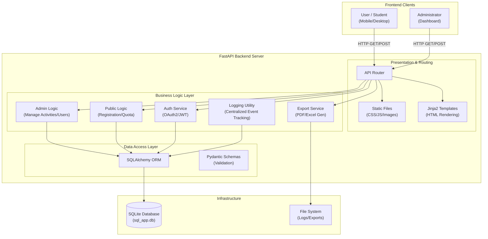

# DSNPRU_REG - School Activity Registration System

A comprehensive web-based activity registration system designed for schools. It allows students to view and register for activities, while providing administrators with powerful tools to manage activities, students, and registration data. Built with **FastAPI** for high performance and **Alpine.js** for a responsive, modern frontend.

---

## Table of Contents

- [Overview](#overview)
- [Features](#features)
- [Architecture](#architecture)
- [Installation](#installation)
- [Configuration](#configuration)
- [Usage Guide](#usage-guide)
- [API Reference](#api-reference)
- [Database Schema](#database-schema)
- [Troubleshooting](#troubleshooting)

---

## Overview

DSNPRU_REG solves the challenge of manual activity registration in schools:

- **Eliminates Paperwork**: Students register online, saving paper and reducing errors.
- **Real-time Quota Management**: Prevents overbooking of activities automatically.
- **Centralized Data**: All registration data is stored securely and is easily exportable.
- **Comprehensive Logging**: Tracks every administrative action and student registration for full accountability.
- **Role-Based Access**: Distinguishes between General Staff and Super Administrators for secure management.

---

## Features

### Public / Student Interface

The student-facing side is designed for ease of use and quick access information:

- **Activity Browser**: View all available activities with descriptions, remaining seats, and schedules.
- **Real-time Status**: Clearly see which activities are Open or Closed.
- **Responsive Design**: Works perfectly on mobile phones, tablets, and desktop computers.
- **Clickable Branding**: The navigation bar logo and title now link directly back to the main registration page.

### Admin Dashboard & Management

A comprehensive backend for school staff, accessed via a **hidden login portal**:

**Security & Access**
- **Hidden Admin Link**: The admin login is discreetly located by clicking the **©** copyright symbol in the footer of the main page.
- **Secure Authentication**: JWT-based login sessions with automatic timeout.
- **Role-Based Access Control (RBAC)**:
    - **Superuser**: Can manage other admins and view system logs.
    - **Staff**: Can manage activities and students but cannot alter system settings.

**Activity Management**
- **CRUD Operations**: Create, Read, Update, and Delete activities.
- **Grouping**: Organize activities into groups (e.g., "Sports", "Academic Clubs") with group-level quotas.
- **Classroom Restrictions**: Limit activities to specific classrooms (e.g., "M.1/1 only").
- **Time Scheduling**: Set automatic open and close times for registration.
- **Manual Toggles**: Instantly Open/Close registration for specific activities with a single click.

**Student Management**
- **Bulk Imports**: Import student lists via Excel files.
- **Search & Filter**: Quickly find students by name or ID.
- **Bulk Actions**: Delete multiple students or update their classroom info in one go.
- **Registration History**: View detailed activity history for each student.
- **Manual Removal**: Admins can now manually remove students from an activity via the Activity Details page.

**Comprehensive Logging System**
- **Action Tracking**: The system logs **ALL** critical actions, including:
    - **Admin Actions**: Login, Logout, Change Password, Create/Delete Admin.
    - **Activity Management**: Create, Update, Delete, and Toggle Status of activities.
    - **Student Management**: Import, Update, Delete, and Bulk operations.
    - **Student Actions**: Student registrations are logged with timestamps.
- **Log Viewer**: Superusers can view the full event history in the "Logs" tab of the dashboard.

**Registration Tracking**
- **Live Monitoring**: See incoming registrations in real-time.
- **PDF/Excel Exports**: Download professional registration lists for teachers.

---

## Architecture

### System Design

The system follows a monolithic architecture with clear separation of concerns between the presentation, logic, and data layers.



### Data Flow Breakdown

1.  **Request Handling**:
    - **FastAPI (Uvicorn)** receives HTTP requests.
    - **Middleware** handles CORS and Logging.
    - **Router** directs traffic to `public` (students), `admin` (management), or `export` endpoints.

2.  **Processing**:
    - **Dependencies** inject database sessions and current user details (via JWT).
    - **Business Logic** verifies quotas, checks classroom restrictions, and validates input via **Pydantic**.
    - **Logging Utility** (`utils.py`) intercepts critical actions and writes them to the `admin_logs` table.

3.  **Persistence**:
    - **SQLAlchemy** translates Python objects to SQL queries.
    - **SQLite** stores persistent data in `sql_app.db`, ensuring ACID compliance for transactions (like registration claiming).

4.  **Presentation**:
    - **Jinja2** renders HTML templates on the server side, injecting dynamic data (e.g., list of activities).
    - **Alpine.js** on the client side handles interactivity (validations, modals, async fetch requests) without full page reloads.

### Technology Stack

**Backend**
- **FastAPI**: Modern, fast (high-performance) web framework for building APIs with Python.
- **SQLAlchemy**: The Python SQL Toolkit and Object Relational Mapper.
- **Pydantic**: Data validation using Python type hints.
- **Uvicorn**: ASGI web server implementation.

**Frontend**
- **HTML5 & Jinja2 Templates**: Server-side rendering for SEO and speed.
- **Tailwind CSS**: Utility-first CSS framework for rapid UI development.
- **Alpine.js**: Lightweight JavaScript framework for adding interactivity.
- **SweetAlert2 & Toastify**: For beautiful, responsive alerts and notifications.
- **Chart.js**: For data visualization on the dashboard.

**Data & Export**
- **SQLite**: Lightweight, serverless database engine.
- **Pandas / OpenPyXL**: For efficient Excel data processing and export.
- **FPDF2**: For generating PDF reports.

---

## Installation

### Prerequisites

- Python 3.9 or higher
- pip (Python package manager)

### Step 1: Clone the Repository

```bash
git clone https://github.com/Nonx2360/DSNPRU_REG.git
cd DSNPRU_REG
```

### Step 2: Virtual Environment

It is recommended to use a virtual environment to manage dependencies.

```bash
# Windows
python -m venv venv
.\venv\Scripts\activate

# macOS / Linux
python3 -m venv venv
source venv/bin/activate
```

### Step 3: Install Dependencies

```bash
pip install -r requirements.txt
```

### Step 4: Run the Server

```bash
uvicorn backend.main:app --reload
```

The application will be available at:
- **Public**: `http://localhost:8000/`
- **Admin**: Click the **©** symbol in the footer or visit `http://localhost:8000/admin/login`
- **API Docs**: `http://localhost:8000/docs`

---

## Configuration

The system is designed for zero-configuration startup.

**Default Admin Credentials:**
On the first run, if no admin exists, the system automatically creates:
- **Username**: `admin`
- **Password**: `admin123`

*Please change this password immediately after your first login.*

**Database:**
The system uses `sql_app.db` (SQLite) created automatically in the root directory.

---

## Usage Guide

### For Administrators

1.  **Login**: Click the hidden **©** symbol in the footer of the main page.
2.  **Dashboard**: Overview of current status. Use the sidebar or toolbar to navigate.
3.  **Manage Students**:
    - Go to "Student Management".
    - Click "Import (Excel)" to upload your student list.
    - Format: `Number`, `Name`, `Classroom` columns.
4.  **Create Activities**:
    - Go to "Manage Activities".
    - Click "New Activity" or use "Group Manager" to create quotas for sets of activities.
    - Set start/end times for automatic control.
5.  **Remove Students**:
    - Navigate to the activity detail page.
    - Click the trash icon next to a student's name to remove their registration. **(Action Logged)**
6.  **Export Data**:
    - Go to "Export".
    - Select "All Activities" or a specific one.
    - Choose PDF or Excel format. `window.open` is used for PDF previews.

### For Students

*Note: The current version focuses on the Admin management side. The public registration interface is accessed via the main landing page.*

1.  Visit the home page.
2.  Browse available activities.
3.  Click to register (requires student ID verification if configured).

---

## API Reference

The API is fully documented with Swagger UI at `/docs`. Key endpoints include:

### Auth
- `POST /token`: Login and retrieve JWT token.
- `POST /admin/logout`: Logout and log the event.

### Admin
- `GET /admin/api/dashboard`: Get dashboard statistics.
- `GET /admin/api/students`: List all students.
- `POST /admin/api/students`: Create a new student.
- `PUT /admin/api/students/{id}`: Update student details.
- `DELETE /admin/api/students/{id}`: Remove a student.
- `GET /admin/api/logs`: View system event logs (Superuser only).

### Activities
- `GET /admin/api/activities`: List all activities.
- `POST /admin/create_activity`: Create a new activity.
- `DELETE /admin/activities/{id}`: Delete an activity.
- `POST /admin/activities/{id}/toggle`: Open/Close registration manually.
- `DELETE /admin/registrations/{id}`: Remove a student from an activity.

### Groups
- `GET /admin/api/activity_groups`: List modifier groups.
- `POST /admin/api/activity_groups`: Create a new group.

---

## Database Schema

### Core Tables

**students**
- `id`: Integer, Primary Key
- `name`: String, Student Name
- `number`: String, Student ID Number (e.g., 64001)
- `classroom`: String, Class (e.g., M.6/1)

**activities**
- `id`: Integer, Primary Key
- `title`: String, Activity Name
- `description`: String
- `max_people`: Integer, Quota per activity
- `status`: String ('open'/'close')
- `start_time` / `end_time`: DateTime
- `group_id`: Foreign Key linked to `activity_groups`

**activity_groups**
- `id`: Integer, Primary Key
- `name`: String (e.g., "Sports")
- `quota`: Integer, Max selections allowed from this group per student

**registrations**
- `id`: Integer, Primary Key
- `student_id`: FK to `students`
- `activity_id`: FK to `activities`
- `timestamp`: DateTime of registration

**admins**
- `id`: Integer, Primary Key
- `username`: String
- `password_hash`: String (Bcrypt)
- `is_superuser`: Boolean

**admin_logs**
- `id`: Integer, Primary Key
- `admin_username`: String (User who performed action)
- `action`: String (e.g., LOGIN, DELETE_ACTIVITY)
- `details`: String (Contextual info)
- `ip_address`: String (Client IP)
- `timestamp`: DateTime

---

## Troubleshooting

### "Database is locked"
SQLite allows limited concurrent writes. If you encounter this during heavy bulk operations, ensure no other process (like a DB browser) has the file open in write mode.

### Login Failed
If `admin` / `admin123` doesn't work, ensure the database initialized correctly. Delete `sql_app.db` and restart the server to re-seed the default admin.

### PDF Preview Blocked
If clicking "Export PDF" doesn't open a new tab, check your browser's pop-up blocker settings and allow pop-ups for your site.

---

## License

This project is open-source and available under the [MIT License](LICENSE).
