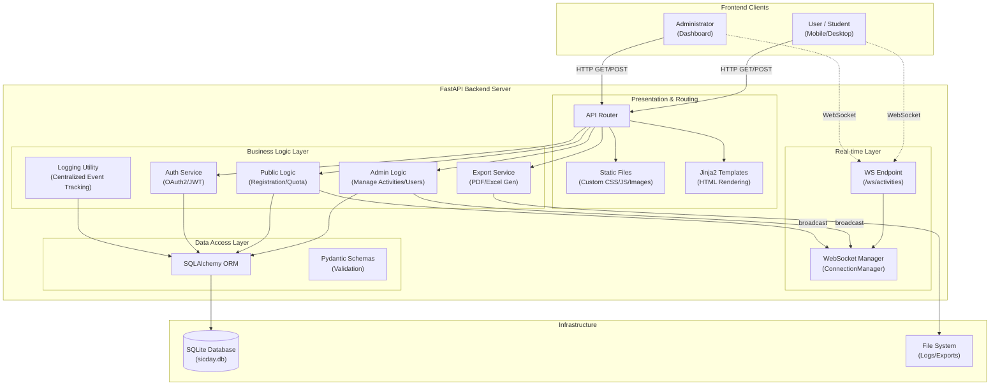

# DSNPRU_REG - School Activity Registration System

**Version 3.3.0**

A comprehensive web-based activity registration system designed for schools. It allows students to view and register for activities, while providing administrators with powerful tools to manage activities, students, and registration data. Built with **FastAPI** for high performance, **WebSockets** for real-time updates, **Alpine.js** for interactivity, and a **custom CSS design system** with full dark mode support.

---

## Table of Contents

- [Overview](#overview)
- [Features](#features)
- [Architecture](#architecture)
- [Installation](#installation)
- [Configuration](#configuration)
- [Usage Guide](#usage-guide)
- [API Reference](#api-reference)
- [Database Schema](#database-schema)
- [Troubleshooting](#troubleshooting)

---

## Overview

DSNPRU_REG solves the challenge of manual activity registration in schools:

- **Eliminates Paperwork**: Students register online, saving paper and reducing errors.
- **Real-time Quota Management**: Prevents overbooking of activities automatically.
- **Centralized Data**: All registration data is stored securely and is easily exportable.
- **Comprehensive Logging**: Tracks every administrative action and student registration for full accountability.
- **Role-Based Access**: Distinguishes between General Staff and Super Administrators for secure management.
- **Team Activity Support**: Full support for team/partner-based activities with configurable team sizes.

---

## Features

### Public / Student Interface

The student-facing side is designed for ease of use and quick access to information:

- **Activity Browser**: View all available activities with descriptions, remaining seats, and schedules.
- **Real-time Status**: Clearly see which activities are Open or Closed, updated instantly via WebSocket.
- **Activity Type Badges**: Visual indicators showing whether an activity is Individual (เดี่ยว) or Team/Partner (ทีม/คู่).
- **Responsive Design**: Works perfectly on mobile phones, tablets, and desktop computers.
- **Dark Mode**: Full dark mode support with automatic theme persistence via localStorage.
- **System Announcements**: View important messages broadcast by administrators with color-coded banners, updated in real-time via WebSocket.
- **Urgent Announcements**: Critical announcements appear as modal popups requiring user acknowledgement, with an optional "don't show again" checkbox.
- **Student Context Display**: After entering student number, view registered activities and remaining group quotas.
- **Partner Search Autocomplete**: Search for partners by name or student number with autocomplete dropdown.
- **Registration Status**: Display whether registration is active or waitlisted.

### Team Registration System (V3 NEW)

A complete system for registering team-based or partner-based activities:

- **Activity Types**: Activities can be configured as "Individual" (เดี่ยว) or "Team" (ทีม/คู่).
- **Configurable Team Size**: Admins can set maximum team members per activity (e.g., 2 for pairs, 5 for teams).
- **Dynamic Partner Input**: Registration modal dynamically shows input boxes based on max team size.
  - If max = 5, students see 4 partner input boxes (for members 2-5, since they are member 1).
- **Partner Search**: Each partner slot has autocomplete search by name or student number.
  - Excludes self and already-selected partners from results.
  - Shows confirmation when a partner is selected (green highlight).
  - Clear button (X) to remove a selected partner.
- **Team Name**: Students can optionally name their team/group.
- **Apply Alone Option**: Students can choose to register for a team activity as a solo participant.
- **Validation**: Backend validates:
  - Team size does not exceed maximum allowed.
  - No duplicate partners.
  - All partners exist in the system.
  - Partners are not already registered for the activity.
- **Member Summary**: Real-time display of how many team members are selected.

### Student Registration Cancellation (V3 NEW)

Students can now manage their own registrations:

- **Cancel Button**: Each registered activity shows a trash icon button.
- **Confirmation Dialog**: SweetAlert2 confirmation before cancellation.
- **Ownership Validation**: Backend verifies the student owns the registration before allowing cancellation.
- **Real-time Update**: After cancellation, the UI updates to reflect new quotas and available seats.

### Admin Dashboard & Management

A comprehensive backend for school staff, accessed via a **hidden login portal**:

**Security & Access**
- **Hidden Admin Link**: The admin login is discreetly located by clicking the **©** copyright symbol in the footer of the main page.
- **Secure Authentication**: JWT-based login with access tokens.
- **Password Management**: Admins can change their own passwords with validation of old password.
- **Role-Based Access Control (RBAC)**:
    - **Superuser**: Can manage other admins, view system logs, and access all administrative functions.
    - **Staff**: Can manage activities, students, and groups but cannot create/delete admin accounts.

**Activity Management**
- **CRUD Operations**: Create, Read, Update, and Delete activities with full control.
- **Activity Types**: Choose between Individual and Team activities when creating.
- **Max Team Size**: For team activities, set the maximum number of members allowed per team (1-10).
- **Group Organization**: Organize activities into groups (e.g., "Sports", "Academic Clubs") with group-level quotas and visibility toggle.
- **Classroom Restrictions**: Limit activities and groups to specific classrooms (e.g., "M.1/1 only").
- **Time Scheduling**: Set automatic open and close times for registration.
- **Color Coding**: Assign custom colors to activity cards for visual organization.
- **Activity Detail Page**: View all registrations for an activity with the ability to manually remove students.

**Student Management**
- **Bulk Imports**: Import student lists via Excel files (formats: 5-column and 6-column with sequence number).
- **Search & Filter**: Quickly find students by name or ID.
- **Class Number Tracking**: Track both student ID (รหัส) and class sequence number (เลขที่) for accurate identification.
- **Bulk Actions**: Delete multiple students in batch operations.
- **Student Details**: View and edit student information including name, classroom, student ID, and sequence number.
- **Manual Removal**: Remove students from specific activities via the Activity Details page.

**Comprehensive Logging & Audit System**
- **Action Tracking**: The system logs **ALL** critical actions, providing full audit trail:
    - **Admin Actions**: Login, Logout, Change Password, Create/Delete Admin.
    - **Activity Management**: Create, Update, Delete activities.
    - **Student Management**: Import, Delete students.
    - **Student Actions**: Student registrations and cancellations with timestamps.
- **Request Logging**: All API requests are tracked with timestamp, method, path, status code, and response time.
- **Log Viewer**: Superusers can view the complete event history in the admin logs, sorted by timestamp.
- **IP Address Tracking**: Logs include client IP addresses for security monitoring.

**System Announcements**
- **Broadcast Messages**: Create and manage system-wide announcements visible on the public page.
- **Color-Coded Alerts**: Assign colors to announcements for visual emphasis (Rose, Indigo, Emerald, Amber).
- **Urgent Announcements**: Mark announcements as "urgent" to display as a modal popup instead of a banner bar.
  - Users can check "ไม่แสดงอีก" (don't show again) to dismiss per-announcement.
  - Admin edits/reactivation automatically resets dismissed state for all users.
- **Activation Toggle**: Enable/disable announcements without deleting them.
- **Real-time Updates**: Announcements are pushed to all connected clients instantly via WebSocket.
- **Timestamp Tracking**: Each announcement records creation time, updated on every edit.

**Data Export**
- **Excel Export**: Comprehensive registration lists with activity, student name, classroom, student ID, and sequence number columns.
- **PDF Export**: Professional registration reports with Thai font support and formatted tables.
- **Filtered Exports**: Export all registrations or filter by specific activity.
- **Team-Aware Formatting**: For team activities, exports properly display team names and member information.

---

## Architecture

### System Design

The system follows a monolithic architecture with clear separation of concerns between the presentation, logic, and data layers.


```mermaid
graph TD
    subgraph Clients["Frontend Clients"]
        Student["User / Student<br>(Mobile/Desktop)"]
        Admin["Administrator<br>(Dashboard)"]
    end

    subgraph Server["FastAPI Backend Server"]
        direction TB
        
        subgraph Presentation["Presentation & Routing"]
            Static["Static Files<br>(Custom CSS/JS/Images)"]
            Templates["Jinja2 Templates<br>(HTML Rendering)"]
            APIRouter["API Router"]
        end

        subgraph Realtime["Real-time Layer"]
            WSManager["WebSocket Manager<br>(ConnectionManager)"]
            WSEndpoint["WS Endpoint<br>(/ws/activities)"]
        end

        subgraph Logic["Business Logic Layer"]
            AuthService["Auth Service<br>(OAuth2/JWT)"]
            AdminLogic["Admin Logic<br>(Manage Activities/Users)"]
            PublicLogic["Public Logic<br>(Registration/Quota)"]
            ExportService["Export Service<br>(PDF/Excel Gen)"]
            LogService["Logging Utility<br>(Centralized Event Tracking)"]
        end

        subgraph DataAccess["Data Access Layer"]
            ORM["SQLAlchemy ORM"]
            Schemas["Pydantic Schemas<br>(Validation)"]
        end
    end

    subgraph Infrastructure["Infrastructure"]
        SQLite[("SQLite Database<br>(sicday.db)")]
        FileSystem["File System<br>(Logs/Exports)"]
    end

    %% Client Interactions
    Student -->|HTTP GET/POST| APIRouter
    Admin -->|HTTP GET/POST| APIRouter
    Student -.->|WebSocket| WSEndpoint
    Admin -.->|WebSocket| WSEndpoint
    
    %% WebSocket Flow
    WSEndpoint --> WSManager
    AdminLogic -->|broadcast| WSManager
    PublicLogic -->|broadcast| WSManager

    %% Internal Server Flow
    APIRouter --> Templates
    APIRouter --> Static
    APIRouter --> AuthService
    APIRouter --> AdminLogic
    APIRouter --> PublicLogic
    APIRouter --> ExportService

    %% Logic to Data interactions
    AdminLogic --> ORM
    PublicLogic --> ORM
    AuthService --> ORM
    LogService --> ORM
    
    %% Data to Infrastructure
    ORM --> SQLite
    ExportService --> FileSystem
```

### Data Flow Breakdown

1.  **Request Handling**:
    - **FastAPI (Uvicorn)** receives HTTP requests.
    - **Middleware** handles CORS and Logging.
    - **Router** directs traffic to `public` (students), `admin` (management), or `export` endpoints.

2.  **Processing**:
    - **Dependencies** inject database sessions and current user details (via JWT).
    - **Business Logic** verifies quotas, checks classroom restrictions, validates team sizes, and validates input via **Pydantic**.
    - **Logging Utility** (`utils.py`) intercepts critical actions and writes them to the `admin_logs` table.

3.  **Real-time Updates**:
    - **WebSocket Manager** maintains a pool of active client connections.
    - When activities or announcements change, the backend broadcasts events (`update_activities`, `update_announcements`) to all connected clients.
    - Clients automatically re-fetch data on receiving a broadcast, ensuring all users see changes instantly.
    - Auto-reconnect with 3-second backoff on disconnection.

4.  **Persistence**:
    - **SQLAlchemy** translates Python objects to SQL queries.
    - **SQLite** stores persistent data in `sicday.db`, ensuring ACID compliance for transactions (like registration claiming).

5.  **Presentation**:
    - **Jinja2** renders HTML templates on the server side, injecting dynamic data (e.g., list of activities).
    - **Alpine.js** on the client side handles interactivity (validations, modals, async fetch requests) without full page reloads.
    - **Custom CSS Design System** with CSS custom properties (tokens), BEM naming, and full dark mode support.

### Technology Stack

**Backend**
- **FastAPI**: Modern, fast (high-performance) web framework for building APIs with Python.
- **SQLAlchemy**: The Python SQL Toolkit and Object Relational Mapper.
- **Pydantic**: Data validation using Python type hints.
- **Uvicorn**: ASGI web server implementation.

**Frontend**
- **HTML5 & Jinja2 Templates**: Server-side rendering for SEO and speed.
- **Custom CSS Design System**: Token-based CSS with BEM naming, full dark mode, and responsive layouts.
- **Alpine.js**: Lightweight JavaScript framework for adding interactivity.
- **SweetAlert2 & Toastify**: For beautiful, responsive alerts and notifications.
- **Chart.js**: For data visualization on the dashboard.
- **Heroicons (SVG)**: Inline SVG icons for consistent, scalable UI elements.

**Real-time**
- **WebSocket (native)**: Push-based updates for activities and announcements via `/ws/activities`.

**Data & Export**
- **SQLite**: Lightweight, serverless database engine.
- **Pandas / OpenPyXL**: For efficient Excel data processing and export.
- **ReportLab (FPDF2)**: For generating PDF reports with Thai font support.

---

## Installation

### Prerequisites

- Python 3.9 or higher
- pip (Python package manager)

### Step 1: Clone the Repository

```bash
git clone https://github.com/Nonx2360/DSNPRU_REG.git
cd DSNPRU_REG
```

### Step 2: Virtual Environment

It is recommended to use a virtual environment to manage dependencies.

```bash
# Windows
python -m venv venv
.\venv\Scripts\activate

# macOS / Linux
python3 -m venv venv
source venv/bin/activate
```

### Step 3: Install Dependencies

```bash
pip install -r requirements.txt
```

### Step 4: Database Setup

The system automatically creates all necessary database tables on first run. No manual migrations are required for fresh installations.

If upgrading from a version prior to V3.0, you may need to run migration scripts to update existing database schemas:

```bash
# For adding team activity support (V3.0+)
python migrate_db.py

# For adding sequence number field (V3.1.5+)
python migrate_sequence.py
```

These scripts will safely add new columns without affecting existing data.

### Step 5: Run the Server

```bash
uvicorn backend.main:app --reload
```

The application will be available at:
- **Public**: `http://localhost:8000/`
- **Admin**: Click the **©** symbol in the footer or visit `http://localhost:8000/admin/login`
- **API Docs**: `http://localhost:8000/docs`

---

## Configuration

The system is designed for zero-configuration startup with sensible defaults.

**Default Admin Credentials:**
On the first run, if no admin exists, the system automatically creates:
- **Username**: `admin`
- **Password**: `admin123`

**⚠️ SECURITY WARNING**: Change this password immediately after your first login using the "Change Password" feature in the admin dashboard.

**Database:**
The system uses `sicday.db` (SQLite) created automatically in the root directory. Ensure write permissions for the application.

**Environment Setup:**
No environment variables are required for basic operation. The system can run standalone after dependency installation.

---

## Usage Guide

### For Administrators

1.  **Initial Login**:
    - Use default credentials (Username: `admin`, Password: `admin123`).
    - Click the hidden **©** copyright symbol in the footer of the main page.
    - Immediately change your password in the admin dashboard.

2.  **Dashboard Overview**:
    - View summary statistics after login.
    - Use the sidebar to navigate between different admin functions.

3.  **Manage Admin Accounts** (Superuser Only):
    - Go to "Admin Settings" or use the admin API.
    - Create new admin accounts with username and password.
    - Set superuser privileges for trusted administrators.
    - Delete admin accounts (cannot delete own account).
    - Change your own password anytime.

4.  **Manage Students**:
    - Go to "Student Management".
    - **Import Excel File**:
      - Click "Import (Excel)" to upload student list.
      - **Supported Formats**:
        - **New Format (6 columns)**: `รหัส`, `คำนำหน้า`, `ชื่อ`, `นามสกุล`, `ห้อง`, `เลขที่`
        - **Legacy Format (5 columns)**: `รหัส`, `ชื่อ`, `นามสกุล`, `ห้อง`, `เลขที่`
      - System automatically detects and handles both formats.
    - **Manage Individual Students**: Search, view details, edit, or delete students.
    - **Bulk Operations**: Delete multiple students at once.

5.  **Create and Manage Activities**:
    - Go to "Manage Activities".
    - **Create New Activity**:
      - Set title, description, and maximum quota.
      - **Select Activity Type**:
        - **Individual**: Single student registration.
        - **Team**: Multiple students per registration with configurable team size.
      - For team activities, set "Max Team Size" (2-10 members).
      - Set start/end times for automatic registration control.
      - Assign classroom restrictions if needed.
      - Choose a color for visual organization.
    - **Edit Activities**: Modify activity details anytime.
    - **Activity Groups**: Use "Group Manager" to create logical groups of activities with quotas.
    - **View Activity Details**: Click an activity to see all registrations and student details.

6.  **Manage Registrations**:
    - Navigate to Activity Details page.
    - **View Registrations**: See all students registered for an activity.
    - **Remove Students**: Click the trash icon next to a student to remove their registration (action is logged).
    - **Team Information**: For team activities, view team names and all team members.

7.  **Broadcast Announcements**:
    - Create system-wide announcements visible on the public page.
    - Set color for visual emphasis (Rose, Indigo, Emerald, Amber).
    - **Mark as Urgent**: Toggle "ประกาศด่วน" to show announcement as a popup instead of a banner.
    - Activate/deactivate announcements without deletion.
    - All changes push to clients in real-time via WebSocket.

8.  **Export Data**:
    - Go to "Export".
    - **Choose Data**: Export all registrations or a specific activity.
    - **Choose Format**:
      - **Excel**: Detailed spreadsheet with columns: Activity, Student Name, Classroom, Student ID, Sequence Number.
      - **PDF**: Professional formatted report with Thai font support.
    - Both formats include team name information for team activities.

9.  **View Audit Logs** (Superuser Only):
    - Go to "Logs" section.
    - Review all admin actions with timestamps, IP addresses, and details.
    - Track all system activities for security and accountability.
    - Filter by admin, action type, or date range.

### For Students

1.  **Visit the Home Page**:
    - Open the main registration page in your browser.
    - Check for any system announcements at the top of the page.

2.  **Identify Yourself**:
    - Enter your student ID number (รหัส) or full name in the search box.
    - Click to select your name from the autocomplete suggestions.
    - The system will load your registered activities and group quotas.

3.  **View Available Activities**:
    - Browse the complete list of open activities.
    - Look for **Activity Type Badges**:
      - **เดี่ยว (Individual)**: Single student registration.
      - **ทีม/คู่ (Team)**: Team-based registration with multiple members.
    - Check remaining seats before registering.

4.  **Register for an Individual Activity**:
    - Click the "Register" button on the activity card.
    - Confirm your choice in the dialog.
    - Your registration is complete and appears in your registered activities list.

5.  **Register for a Team Activity**:
    - Click the "Register" button on a team activity card.
    - A registration modal appears showing:
      - Maximum team size allowed.
      - Partner input fields based on team size.
      - Team name field (optional).
    - **Option A - Register with Team**:
      - Enter team name (optional).
      - Search and select partners using the autocomplete inputs (minimum 2 characters).
      - Partners are matched by name or student ID.
      - Only students NOT already registered for this activity appear in suggestions.
      - Click the check or select partner name to confirm.
      - Submit to register entire team at once.
    - **Option B - Register Alone**:
      - Check "Apply Alone" option.
      - Submit to register as solo participant.

6.  **View Your Registrations**:
    - After identification, see all your registered activities.
    - View:
      - Activity names and details.
      - Team names (if applicable).
      - Registration status.
    - Check remaining group quotas to see how many more activities you can join.

7.  **Cancel a Registration**:
    - Click the trash/delete icon next to a registered activity.
    - Confirm the cancellation in the dialog.
    - The registration is immediately removed.
    - Seats are freed for other students.
    - Remaining quotas update in real-time.

---

## API Reference

The API is fully documented with Swagger UI at `/docs`. Key endpoints include:

### Authentication
- `POST /admin/login`: Login with username and password, retrieve JWT token.
- `POST /admin/logout`: Logout and log the event (requires authentication).
- `PUT /admin/change-password`: Change password with validation of old password (requires authentication).

### Admin Management (Superuser Only)
- `GET /admin/api/admins`: List all admin accounts.
- `POST /admin/api/admins`: Create a new admin account with username and password.
- `DELETE /admin/api/admins/{admin_id}`: Delete an admin account (cannot delete own account).

### Activity Management
- `GET /admin/api/activities`: List all activities with registration counts and remaining seats.
- `POST /admin/create_activity`: Create a new activity (accepts `type`, `max_team_size`, schedules, and restrictions).
- `PUT /admin/activities/{id}`: Update an activity properties.
- `DELETE /admin/activities/{id}`: Delete an activity.
- `GET /admin/api/activity-detail/{id}`: Get detailed activity information with all registrations.

### Activity Groups
- `GET /admin/api/activity_groups`: List all activity groups.
- `POST /admin/api/activity_groups`: Create a new activity group with quota and classroom restrictions.
- `PUT /admin/api/activity_groups/{group_id}`: Update activity group.
- `DELETE /admin/api/activity_groups/{group_id}`: Delete activity group.

### Student Management
- `GET /admin/api/students`: List all students.
- `POST /admin/api/students/import`: Bulk import students from Excel file (supports 5 and 6-column formats).
- `DELETE /admin/api/students/{id}`: Remove a student.
- `GET /admin/api/students/{id}`: Get student details.

### Logs & Monitoring
- `GET /admin/api/logs`: View system event logs (Superuser only) - includes all admin actions and timestamps.

### Announcements
- `GET /admin/api/announcements`: List all announcements (requires auth).
- `POST /admin/api/announcements`: Create a system announcement (accepts `message`, `is_active`, `is_urgent`, `color`).
- `PUT /admin/api/announcements/{ann_id}`: Update an announcement (timestamp refreshes automatically).
- `DELETE /admin/api/announcements/{ann_id}`: Delete an announcement.
- `GET /api/announcements/active`: Get active announcements visible on public page.

### WebSocket
- `WS /ws/activities`: Real-time event stream. Broadcasts `update_activities` and `update_announcements` events.

### Public (Student) Endpoints
- `GET /api/activities`: List all open activities with `type`, `max_team_size`, remaining seats, and group information.
- `GET /api/search_students?q={query}`: Search students by name or number (minimum 2 characters).
- `GET /api/student_context/{student_number}`: Get student's registered activities, team names, and remaining group quotas.
- `POST /api/register`: Register for an activity.
  - **Body**: `{ name, classroom, number, activity_id, team_name: "Team Name", partner_numbers: ["12345", "12346"] }`
- `DELETE /api/registrations/{id}?student_number={number}`: Cancel a registration (student must own it).

### Export Endpoints
- `GET /export/pdf?activity_id={id}`: Export registrations as a formatted PDF report.
- `GET /export/excel?activity_id={id}`: Export registrations as an Excel spreadsheet.
- Both endpoints support filtering by activity or exporting all registrations.

---

## Database Schema

### Core Tables

**students**
- `id`: Integer, Primary Key
- `name`: String, Student Name
- `number`: String, Student ID Number (e.g., 64001)
- `classroom`: String, Class (e.g., M.6/1)
- `sequence`: Integer, Class sequence number (e.g., 1) - for distinguishing class number from student ID

**activities**
- `id`: Integer, Primary Key
- `title`: String, Activity Name
- `description`: String, Activity Description
- `max_people`: Integer, Quota per activity
- `status`: String ('open'/'close')
- `type`: String ('individual'/'team')
- `max_team_size`: Integer, Max members per team (default 1)
- `start_time` / `end_time`: DateTime, Automatic open/close times
- `color`: String, Hex color code for UI display
- `allowed_classrooms`: String, Comma-separated classroom restrictions
- `group_id`: Foreign Key linked to `activity_groups`

**activity_groups**
- `id`: Integer, Primary Key
- `name`: String, Group name (e.g., "Sports")
- `quota`: Integer, Max selections allowed from this group per student
- `allowed_classrooms`: String, Comma-separated classroom restrictions
- `is_visible`: Boolean, Whether group is visible in student interface

**registrations**
- `id`: Integer, Primary Key
- `student_id`: FK to `students`
- `activity_id`: FK to `activities`
- `team_name`: String, Team/group name for team activities
- `status`: String ('registered'/'waitlisted') - registration status
- `timestamp`: DateTime, Registration time

**admins**
- `id`: Integer, Primary Key
- `username`: String, Unique admin username
- `password_hash`: String, Bcrypt-hashed password
- `is_superuser`: Boolean, Superuser privileges flag

**admin_logs**
- `id`: Integer, Primary Key
- `admin_username`: String, Admin who performed action
- `action`: String, Action type (e.g., LOGIN, CREATE_ACTIVITY, DELETE_STUDENT)
- `details`: String, Contextual information about the action
- `ip_address`: String, Client IP address
- `timestamp`: DateTime, Action timestamp

**announcements**
- `id`: Integer, Primary Key
- `message`: String, Announcement message content
- `is_active`: Boolean, Whether announcement is visible
- `is_urgent`: Boolean, Whether announcement shows as popup (default false)
- `color`: String, Color code for visual emphasis (rose, indigo, emerald, amber)
- `timestamp`: DateTime, Creation/update timestamp (refreshed on every edit)

**request_logs**
- `id`: Integer, Primary Key
- `timestamp`: DateTime, Request timestamp
- `method`: String, HTTP method (GET, POST, PUT, DELETE, etc.)
- `path`: String, API endpoint path
- `status_code`: Integer, HTTP response status code
- `response_time_ms`: Integer, Response time in milliseconds

**system_metrics**
- `id`: Integer, Primary Key
- `timestamp`: DateTime, Metric timestamp
- `metric_type`: String, Type of metric (e.g., "db_size", "db_health", "api_health")
- `value`: Integer, Numeric metric value (e.g., size in bytes)
- `status`: String, Text status (e.g., "up", "down")

---

## Version History

### V3.3.0 (Current)

**Real-time WebSocket Architecture**
- **WebSocket Manager**: Centralized connection pool with auto-reconnect for all clients.
- **Live Activity Updates**: Registration/cancellation changes push instantly to all connected browsers.
- **Live Announcement Updates**: Announcement create/edit/delete pushes to all clients in real-time.
- **Event-Driven**: Backend broadcasts `update_activities` and `update_announcements` events.

**Urgent Announcements**
- **Popup Mode**: Mark announcements as urgent to display as a SweetAlert modal popup instead of a top banner.
- **User Dismissal**: "ไม่แสดงอีก" checkbox lets users dismiss a specific announcement.
- **Auto-Reset on Edit**: Admin edits/reactivation automatically resets dismissed state (timestamp-based key).
- **Separation of Concerns**: Non-urgent = banner bar only. Urgent = popup only.

**Custom CSS Design System**
- **Replaced Tailwind CSS**: Migrated to a custom CSS design system with CSS custom properties (tokens) and BEM naming.
- **Full Dark Mode**: Comprehensive dark mode with proper contrast, toggled via navbar with theme persistence.
- **SVG Icons**: Replaced all emojis with inline Heroicons SVGs for consistent rendering across platforms.

**Platform Status & Analytics Dashboard**
- **Real-time Admin Dashboards**: Analytics and platform status pages use WebSocket for live updates.
- **System Health Monitoring**: API health, DB health, uptime, error rates, and response times.
- **Request Logging**: All API requests tracked with method, path, status code, and response time.

### V3.2.0

**System Monitoring & Analytics**
- **Request Logging**: All API requests are tracked with method, path, status code, and response time.
- **System Metrics**: Track database and API health metrics with timestamped records.
- **Performance Insights**: Monitor response times to identify and optimize bottlenecks.

**System Announcements**
- **Broadcast Messages**: Create and manage system-wide announcements visible on the public page.
- **Color-Coded Alerts**: Assign colors to announcements for visual emphasis.
- **Activation Control**: Enable/disable announcements without deletion.

**Admin Management**
- **Admin Account Management**: Superusers can now create and delete admin accounts via API.
- **Password Management**: All admins can change their own passwords with validation.
- **Improved Access Control**: Clear superuser/staff role separation.

**Enhanced Database Schema**
- **Registration Status**: Registrations now track status (registered/waitlisted) for future waitlist features.
- **Sequence Tracking**: Student sequence number field for class-based identification.
- **Event Tracking**: Dedicated admin_logs table with IP address tracking.

### V3.1.5

**New Student Identification System**
- **Sequence Number (เลขที่)**: Added a dedicated field to distinguish between Student ID (รหัส) and Class Number (เลขที่).
- **New Excel Import Format**: Supports a 6-column format (`รหัส`, `คำนำหน้า`, `ชื่อ`, `นามสกุล`, `ห้อง`, `เลขที่`).
- **Enhanced Exports**: Registration lists (Excel/PDF) include the sequence number column.
- **Improved Student Management**: Admins can view and edit the sequence number field in the dashboard.

### V3.0

**Team Registration System**
- **Activity Types**: Activities can be configured as "Individual" or "Team/Partner".
- **Max Team Size**: Configurable maximum team members per activity (1-10 members).
- **Dynamic Partner Selection**: Registration modal shows partner input boxes based on max team size.
- **Partner Autocomplete Search**: Search for partners by name or student number.
- **Team Name**: Optional naming of teams/groups during registration.
- **Apply Alone**: Option to register for team activities as solo participants.
- **Partner Validation**: Backend validates team sizes, prevents duplicates, and verifies partner existence.

**Student Registration Cancellation**
- **Self-Service Cancellation**: Students can cancel their own registrations from the UI.
- **Ownership Validation**: Backend verifies student ownership before allowing deletion.
- **Confirmation Dialog**: SweetAlert2 confirmation before cancellation.
- **Real-time Updates**: UI updates immediately after cancellation.

**Enhanced Exports**
- **Team Name Column**: Excel exports include the team name column.
- **Team-Grouped PDF**: PDF exports for team activities sort registrations by team name.

### V2.5
- **Analytics Dashboard**: Visual charts for registration trends, group popularity, and classroom participation.
- **Real-time Synchronization**: Background polling for student registration and admin analytics.
- **SweetAlert2 Integration**: Professional confirmation dialogs for destructive actions.
- **Theme Polish**: Improved UI visibility in Dark Mode.

### V2.0
- **RBAC**: Role-Based Access Control (Admin vs Staff).
- **Audit Logs**: Comprehensive logging for administrative actions.
- **Enhanced Security**: JWT-based authentication and secure password hashing.

---

## Troubleshooting

### Admin Login Issues

**Problem**: "Login Failed" message even with correct credentials.
- **Solution 1**: Verify default admin account exists. If not, delete `sicday.db` and restart the server to recreate it.
- **Solution 2**: Check that you're using the correct username and password (default: `admin` / `admin123`).
- **Solution 3**: Ensure your JWT token hasn't expired - try clearing browser cookies and login again.

**Problem**: Can't access admin panel.
- **Solution**: Make sure you clicked the hidden **©** copyright symbol in the footer, or visit `http://localhost:8000/admin/login` directly.

### Database Issues

**Problem**: "Database is locked" error.
- **Cause**: SQLite has limited concurrent write support.
- **Solution**: Ensure no other process has the database open (check file explorer, SQLite browser tools, etc.). Restart the application.

**Problem**: Database migrations fail.
- **Solution 1**: Backup your `sicday.db` file.
- **Solution 2**: Delete `sicday.db` and restart the server to create a fresh database.
- **Solution 3**: If upgrading, ensure you run all migration scripts in order: `migrate_db.py`, then `migrate_sequence.py`.

### Activity Registration Issues

**Problem**: Team activities not working (showing "Individual" instead).
- **Solution 1**: Ensure you've run `python migrate_db.py` to add `type` and `max_team_size` columns.
- **Solution 2**: Restart the application after migration.
- **Solution 3**: Edit the activity in the admin panel and explicitly set "Activity Type" to "Team".
- **Solution 4**: Verify `max_team_size` is greater than 1 (default should be 2).

**Problem**: Partner search returns no results.
- **Cause 1**: Not enough characters typed (minimum 2 required).
- **Cause 2**: Partners already registered for the activity won't appear in suggestions.
- **Cause 3**: Student database is empty or search term doesn't match student names/IDs.
- **Solution**: Bulk import students first from the admin Student Management page using an Excel file.

**Problem**: Can't register for activity - "No seats available" message.
- **Solution**: The activity has reached its quota. Confirm with an admin to increase quota or cancel other registrations.

**Problem**: Student can register for same activity twice.
- **Cause**: This shouldn't happen - the database has a unique constraint.
- **Solution**: Log out and log back in. Refresh the page. Contact admin if issue persists.

### Export Issues

**Problem**: PDF export opens blank or crashes.
- **Solution 1**: Ensure the `frontend/static/fonts/` directory exists with SukhumvitSet font files.
- **Solution 2**: The export falls back to Helvetica if Thai font unavailable (export will still work, just without Thai font optimization).
- **Solution 3**: Check browser console for JavaScript errors.

**Problem**: Excel export has incorrect character encoding (Thai text appears garbled).
- **Cause**: openpyxl encoding issue.
- **Solution**: Open the Excel file and re-save it with UTF-8 encoding in Excel or Google Sheets.

**Problem**: Pop-up blocker prevents PDF from opening.
- **Solution**: Check your browser's pop-up blocker settings and allow pop-ups for your site.

### Student Import Issues

**Problem**: "Invalid Excel format" error during student import.
- **Solution 1**: Verify Excel file has correct columns:
  - **6-column format**: `รหัส`, `คำนำหน้า`, `ชื่อ`, `นามสกุล`, `ห้อง`, `เลขที่`
  - **5-column format**: `รหัส`, `ชื่อ`, `นามสกุล`, `ห้อง`, `เลขที่`
- **Solution 2**: Ensure there are no extra blank columns or rows.
- **Solution 3**: Save the Excel file as .xlsx format (not .xls or .csv).

**Problem**: Students import but duplicate entries appear.
- **Cause**: Student ID numbers already exist in the database.
- **Solution**: Delete existing students first or update the Excel file with unique student IDs.

### Performance Issues

**Problem**: System is slow or unresponsive.
- **Solution 1**: Check system resources (RAM, CPU) using Task Manager.
- **Solution 2**: Reduce number of concurrent users.
- **Solution 3**: Archive old registrations to a backup database if it's very large.
- **Solution 4**: Disable real-time polling on analytics pages if not needed.

**Problem**: Activities page loads very slowly.
- **Cause**: Too many activities or registrations in database.
- **Solution**: Ensure database indices are present. Restart the server and clear any cached data.

### Announcement Issues

**Problem**: Announced messages not appearing on public page.
- **Solution 1**: Make sure the announcement is marked as `is_active = true` in the database.
- **Solution 2**: Check the WebSocket connection in the browser console (should connect to `/ws/activities`).
- **Solution 3**: Clear browser cache (Ctrl+Shift+Delete in most browsers).

**Problem**: Urgent announcement popup not showing.
- **Solution 1**: Check if `is_urgent` is `true` for the announcement in the admin panel.
- **Solution 2**: Clear localStorage (`localStorage.clear()` in browser console) to reset dismissed state.
- **Solution 3**: Edit and re-save the announcement in admin panel — this refreshes the timestamp and resets all dismissals.

---

## License

This project is open-source and available under the [MIT License](LICENSE).
